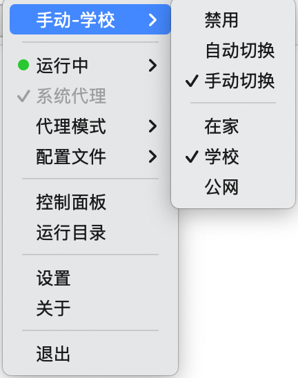
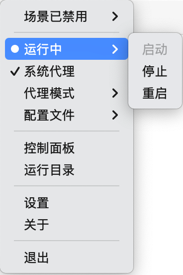
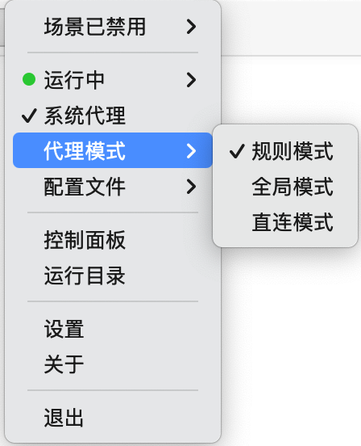
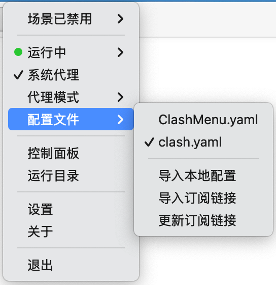
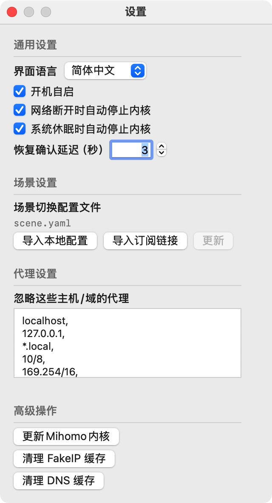
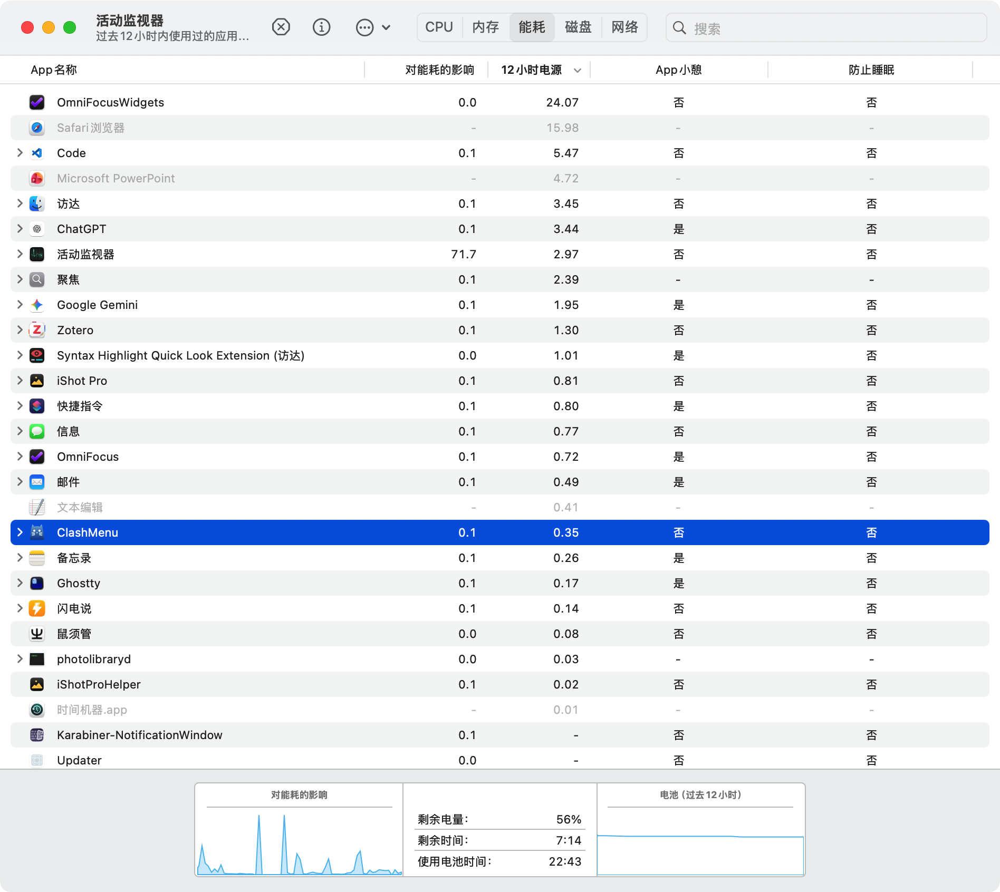

<div align="center">


# ClashMenu

原生 macOS 菜单栏代理客户端（SwiftUI + AppKit），以 `mihomo` 为 Core。

<p>
  
  
  
  
  <a href="https://t.me/clashbars" target="_blank" rel="noopener noreferrer">
    
  </a>
</p>

<p>
  <strong>加入 Telegram 群获取更新与支持：</strong>
  <a href="https://t.me/clashbars" target="_blank" rel="noopener noreferrer">@clashbars</a>
</p>

</div>

<p align="center">
  
  
  
  
  
</p>

---

## 👋 项目简介

ClashMenu 是以macOS上裸核运行mihomo为目标的极简菜单栏客户端，基于 [ClashBar](https://github.com/Sitoi/ClashBar) 。  
在不打开复杂主窗口的前提下，你可以在菜单栏中完成场景切换、配置管理、系统代理控制等常见操作，也可以打开zashboard获取详细信息和复杂操作。 ✨

## 🤖 项目说明

具体项目说明请参考 [ClashBar](https://github.com/Sitoi/ClashBar) 

## 🤖 项目构建

本项目不直接提供构建物下载，请clone源码后自行构建。
`Script/build.sh`
默认根据本机环境进行构建，也可以看一下脚本说明，自定义架构（Apple Silicon/Intel)。

## 🔄 控制面板
配置文件建议写法：
```
external-controller: 127.0.0.1:9090
secret: "your-secret" 
external-ui: ui 
#external-ui-name: zashboard
external-ui-url: "https://github.com/Zephyruso/zashboard/releases/latest/download/dist.zip"
```
ClashMenu没有打包任何Dashboard，所以配置文件中务必要写好external-ui-url，可任选自己喜欢的Dashboard。
`控制面板`按钮会尝试打开 http://127.0.0.1:9090/ui ，如果定义了external-ui-name，网页上会出现一个目录需要二次点击。
## 🔄 场景切换
场景禁用时，可自行开关系统代理、启停内核、切换配置文件。场景自动/手动时，根据场景自动控制系统代理、启停内核等操作。
### 场景配置文件参考
```
scenes:
  - name: "在家"
    description: "家庭网络，已经通过软路由实现代理"
    triggers:
      ssids: 
        - "home_5G"
        - "home_2.4G"
        - "home_2.4G_iot"
    system-proxy: false
    action: "stop"

  - name: "学校"
    description: "学校网络"
    triggers:
      ssids:
        - "school_wifi"
    system-proxy: true
    action: "start"
    config:
      base_file: "clash.yaml"
      overrides:
        allow-lan: false
        hosts:
          "abc.com": "123.123.123.123"

  - name: "公网"
    description: "公共网络，需要全程开启代理"
    triggers:
      ssids:
        - "*" # 匹配所有SSID
    system-proxy: true
    action: "start"
    config:
      base_file: "clash.yaml"
      overrides:
        allow-lan: false
        mode: "rule"
```
### 每种场景命中后，会执行Mixin策略，具体策略是：
1. rules下的数组采用前插入
2. rule-providers / proxy-providers：视为字典进行浅覆盖 (Shallow Update)。如果有同名 provider，新的覆盖旧的；如果有新 provide
r，直接追加。
3. 对于对于 proxies 和 proxy-groups，基于 name 主键的替换与追加策略
4. 其它所有配置项全部采用浅覆盖，对于单个全局项如allow-lan直接覆盖，对于有嵌套项的全局项如dns，直接从根部全部覆盖，因此要求这
些配置项必须写完整。

## 🔄 省电策略
断网、休眠自动停止内核，极为省电。
<p>
  
</p>
## ❓ 常见问题

### 1) macOS 提示“已损坏”或“无法验证开发者” 🔒

**现象**：应用首次启动被系统拦截。  
**原因**：macOS Gatekeeper 对未公证应用的默认安全策略。

**处理步骤**

1. 将应用放置到 `/Applications/ClashMenu.app`。
2. 打开 **系统设置 → 隐私与安全性**，点击「仍要打开（Open Anyway）」。
3. 若仍被拦截，可移除隔离标记后重试：

```bash
sudo xattr -r -d com.apple.quarantine /Applications/ClashMenu.app
```

### 2) 系统代理开启失败 ⚙️

**现象**：点击系统代理开关后未生效或立即回退。  
**原因**：通常与权限授权、Helper 状态或应用安装位置有关。

**处理步骤**

1. 确认使用的是打包后的应用，并位于 `/Applications`。
2. 在 macOS 系统设置中完成 ClashMenu 相关权限批准。
3. 退出应用，重新启动，再次开启系统代理。如果还有问题则可能是特权助手存在问题，需要继续以下步骤：
5. 移除ClashMenu
6. 执行`sudo launchctl bootout system/com.clashmenu.helper`卸载特权助手
7. 重新安装ClashMenu
8. 执行`log stream --style compact --predicate 'process == "com.clashmenu.helper"'`，然后开启系统代理，观察前述日志确定问题所在

## 🙌 反馈与支持

- Telegram 社区：<https://t.me/clashbars>
- Issue / PR：欢迎提交功能建议、稳定性问题与文档修正。 💬

## 👥 贡献者

感谢所有参与贡献的开发者：

[](https://github.com/Sitoi/ClashBar/graphs/contributors)

## 🙏 致谢

- 感谢 [ClashBar](https://github.com/Sitoi/ClashBar) 提供了原始的项目能力
- 感谢 [OpenAI Codex](https://openai.com/codex/) 在需求拆解、工程实现与文档优化中的持续协作。 🤝
- 感谢 [MetaCubeX/mihomo](https://github.com/MetaCubeX/mihomo) 提供稳定可靠的 Core 能力。


## 📄 许可证

本项目采用 `GPL-3.0 license`，详见 [LICENSE](LICENSE)。
